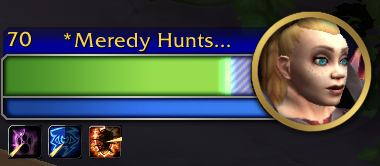

# Overshields

Overshields is an original fork of the abandoned addon DerangementShieldMeters by Derangement. Updates by Casper Rogild Storm and Enth.

Ever wonder how much shield is still left, several hits after you cast Power Word: Shield on someone with full health, or use Death Strike to heal yourself as a tank?

Overshields will provide permanent feedback on total shielding amounts regardless of whether the shielded person's HP is full or not.

Works with Blizzard's default Player, Target, Focus, Party, and Raid frames.

## Installation

### Addon Manager

Install from [Curseforge](https://www.curseforge.com/wow/addons/overshields).

### Manually

Download the [latest release](https://github.com/enthh/overshields/releases/latest) and extract the `.zip` to your AddOns folder.

## License

Overshields is released under the [MIT License.](https://github.com/enthh/overshields/blob/master/LICENSE)
